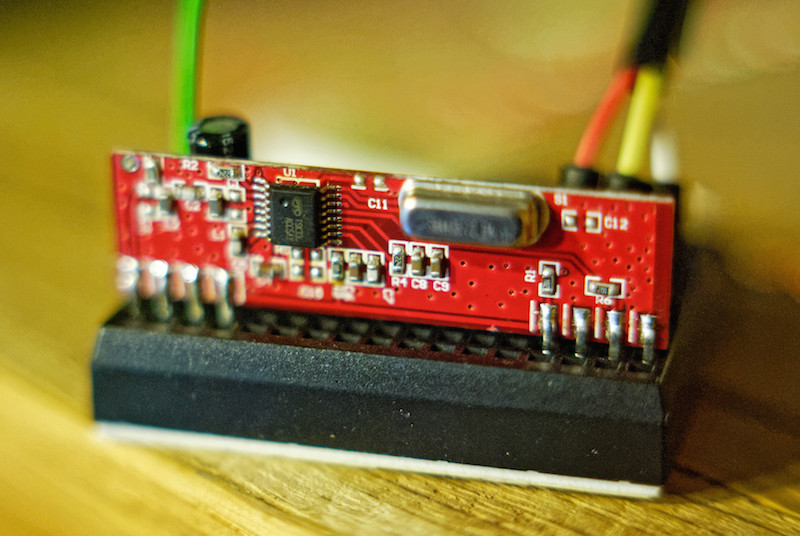

# lrf-listen

## Introduction

This code is for a C language command line tool for the RaspberryPi which will listen for lightwaveRF messages from an attached 433Mhz receiver attached to GPIO. With the right receiver (see below) it has comparable range to official LightwaveRF hardware. 

After investing in LightwaveRF hardware including a hub I was very disappointed that there was no way to receive the messages sent from their sensors such as door reed switches and PIR. It is the case that the only receivers are build into the switches and such like. 

I’ve hard this code in “production” for over six months now and it’s proven to be very reliable not missing messages.
I have it connected to my Polestar IoT Hub software:
[http://polestar.io](http://polestar.io)

## Building
 - install wiringPi library
 - clone or download this repo
 - go to downloaded repo directory and type make

## Usage

sudo lrf-listen GPIO_pin period_in_milliseconds

This will wait a maximum time for a valid message and if one is received will write a single line to standard out:
device id, sub id, command, parameter, number of bit errors

## Design
> Disclaimer: It’s a long time since i’ve done any C coding and this code evolved organically in an attempt to understand the signal and noise characteristics I was working with. The code is probably due a big tidy up but after a couple of days of busy coding I was relieved to have found a working solution.

The design of the code consists of the main entry point with some code to setup the wiringPI library to trigger call backs with the chosen GPIO pin changes state. This then waits for variables containing a received message to be set or timeout before exiting.

The callback function is lw_process_bits. This part of the code consists of a processing pipeline the goes from trying to lock onto the correct frequency of the signal, through determining if we have a high or low bit, looking for the start of message, creating bytes from the bits, looking up the bytes (with redundancy) into nibbles and then finally extracting the message details from the nibbles.

main
 - runLive
 - lw_setup (setup wiring pi with correct state and start listening to interrupts)

lw_process_bits
 - capture (phase locked loop, each transmitted has a slightly different frequency)
 - writeCaptureBits (accumulate time spend high and low to determine most likely boolean state)
 - writeBit (convert pulse lengths to bits)
 - writeBit2 (receive bits to build array of bits of right length if possible)
 - onMessage (run through bits converting to received bytes)
 - nibbleLookup (convert transmitted bytes to real data nibbles)
 - onMessage2 (final checks and extract message details from nibbles)
 - addCandidate (sets message details for runLive() to pickup)

## Hardware
LightwaveRF uses 433Mhz with ASK /OOK modulation. Regular 433Mhz receivers will work. However after trying several cheap super-regeneration based receivers from ebay on not getting a range more than a meter I look for a better quality receiver and found this Super Heterodyne based model:
[http://www.quasaruk.co.uk/acatalog/info_QAM_RX4_433.html](http://www.quasaruk.co.uk/acatalog/info_QAM_RX4_433.html)

Connecting to the Pi is very easy and requires no special circuitry. 

I experimented with various antenna designs including a ground plane and special tuned springs but found that a simple length of wire of about 35cm (half wavelength) worked at least as good as other solutions.

## Credit
This code started out being based on Jonathan Leach’s (lightwaverf-pi) RaspberryPi port of Lawrie Griffiths Arduino library but has been completely rewritten from the ground up to be much more tolerant of a lower SNR (signal to noise ratio) hence has a much higher range comparable with official LightwaveRF hardware)

[https://github.com/leachj/lightwaverf-pi](https://github.com/leachj/lightwaverf-pi)
[https://jonathanleach1.wordpress.com/2014/02/22/lightwaverf-raspberry-pi/](https://jonathanleach1.wordpress.com/2014/02/22/lightwaverf-raspberry-pi/)

Also I’ve used various sources of knowledge about the inner workings of the protocol including the work of Ben Gillam
[http://www.benjiegillam.com/2013/02/lightwaverf-rf-protocol/](http://www.benjiegillam.com/2013/02/lightwaverf-rf-protocol/)

## lightwaverf-pi

This code is a port of the excellent [lightwaverf arduino library](https://github.com/lawrie/LightwaveRF) written by Lawrie Griffiths to the Raspberry Pi. It utilises the [WiringPi](http://wiringpi.com/) library to do most of the GPIO work. 

To use this library you will need a 433 Mhz transmitter and/or receiver attached to your Pi. The default is to pin 1 and 0 respectivly (wiring pi pin numbers not the actual processor numbers, see [http://wiringpi.com/pins/]). If you want to use different pin numbers these can be set in the call to lw_setup().

To compile the code you will need wiring pi installed. Instructions can be found [here](http://wiringpi.com/download-and-install/). When this installed run `make` followed by `sudo make install` this will build the library and two example programs: send and receive. `send <0,1>` will send either a off or on signal the the code specified on the send.cpp file. `receive` will print out all of the code it receives. These command will also make the library available for other programs to use with the .so files in /usr/local/lib and the lightwaverf.h file into /usr/local/include

